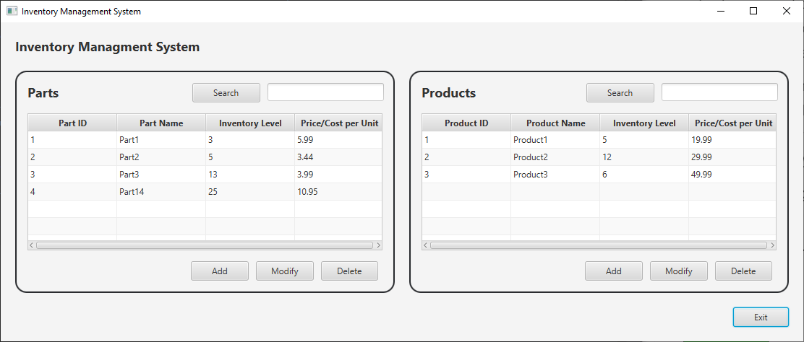
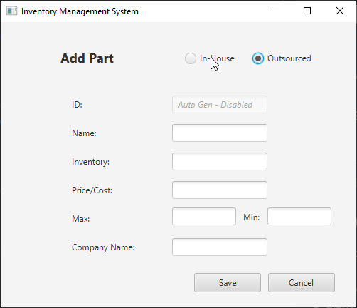
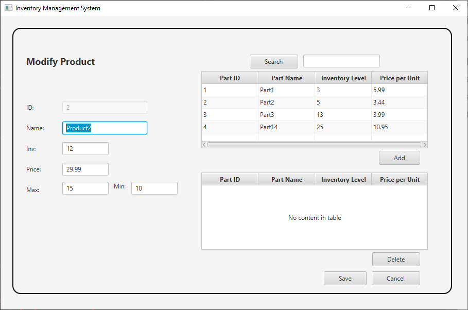

# Inventory Management Application
An inventory management application build with Java and JavaFX (Scenebuilder) for the frontend.

### Installation
1. Clone the repositiory
2. Open the project folder in your IDE of choice
3. Runt the Main.java file.

### Features
* Dashboard displays parts and products currently in stock.
* Products display the parts required for the product.
* Alerts user when product is priced lower than its constituent parts.
* Other alerts and error messages display to confirm the user's actions.

### Project Takeaways
**Java OOP**: Use of object-oriented principles to keep code organized and easy to maintain. 
 
**MVC Design pattern**: Utilize model view controller (MVC) design pattern segregate the data model from
the presentation information and control information.

### Images
**Main Screen**: 

  
**Add Part**: 

  
**Modify Product**: 

  